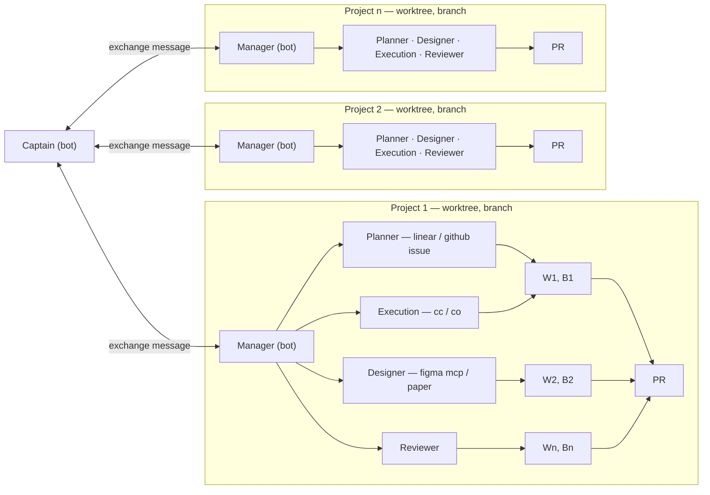

# Bosun

Bosun is an open-source **agentic software factory**. Instead of driving one coding
agent at a time, you direct a crew: a **Captain** coordinates **Managers**, and each
Manager runs a team of bots — **Planner**, **Designer**, **Execution**, **Reviewer** —
across **Projects** and the **Features** they deliver.

Bosun is a downstream fork of [T3 Code](#the-t3-code-harness) and uses it as its agent
harness and control surface. The name comes from _boatswain_ ("bosun") — the officer
who runs the deck crew under the captain.

## Credit where it's due

Bosun stands entirely on [T3 Code](https://github.com/pingdotgg/t3code), built by
[T3 Tools](https://t3.codes) — Theo Browne, Julius Marminge, and the T3 Code
contributors.

- **All credit for the underlying harness goes to the T3 Code team.** The agent
  subprocesses, provider adapters, orchestration engine, desktop/web/mobile clients,
  and everything that makes agents actually run are their work, not ours.
- Bosun would not exist without T3 Code, and we intend to keep merging upstream in as
  they ship it (see [`BOSUN.md`](./BOSUN.md)).
- T3 Code is MIT-licensed (`LICENSE`, © T3 Tools Inc.). We keep their copyright and
  permission notice intact.

Bosun is an independent project. It is **not affiliated with or endorsed by T3 Tools**,
and it ships under its own name, identity, and branding.

## What is Bosun?

An agentic software factory — a system for running _organizations_ of agents rather
than single conversations.

- **Captain** — a bot, and the single source you talk to. It asks each project's
  Manager what they're doing and which feature is in flight, and relays your wishes.
  Managers can also ask the Captain to ask you on their behalf.
- **Manager** — one per project, and a bot itself. It plans the work and drives the
  project's crew.
- **Bots** — the crew: **Planner** (Linear / GitHub issues), **Designer** (Figma MCP /
  paper), **Execution**, and **Reviewer**. Each bot has a hierarchy, rules, context,
  skills, models, and MCP tools, and usually one job it does well. Bots can ask each
  other for context — a Designer asks the Planner; a Planner asks its Manager.
- **Projects** — a container (its own worktree and branch). A set of tasks, not
  necessarily coding: another codebase, a stock portfolio, anything you can describe.
  A project's crew turns features into branches that converge into a PR.
- **Features** — the units a project's crew delivers.

Bots negotiate with each other: a Designer that is unsure asks the Planner for
confirmation; a Planner that lacks context asks its Manager. Every request has one
clear home.



That is the direction, not a finished product.

## Status

Very early. Today Bosun is the T3 Code harness with the Bosun identity applied; the
factory layer above it — the Captain, the Manager/bot hierarchy, and cross-bot
messaging — is under active construction. Expect rough edges.

## The T3 Code harness

Everything below describes the upstream harness Bosun is built on. Bosun does not
publish its own builds yet; until it does, you can run the upstream T3 Code it is
based on.

T3 Code is an "agent harness control surface". It enables control of the agents on
your machine with a best-in-class mobile app ([iOS](https://apps.apple.com/us/app/t3-code-remote-claude-more/id6787819824),
[Android](https://play.google.com/store/apps/details?id=com.t3tools.t3code)),
[web app](https://app.t3.codes) and [Electron-based desktop app](https://t3.codes).

Works with your subscriptions on Claude Code, Codex, Cursor, Grok Build, OpenCode, and
Google Antigravity. If they're set up on your computer, T3 Code can control them.

### Installation

> [!WARNING]
> The harness currently supports Codex, Claude, Cursor, Grok Build, OpenCode, and
> Antigravity. Install and authenticate at least one provider before use:
>
> - Codex: install [Codex CLI](https://developers.openai.com/codex/cli) and run `codex login`
> - Claude: install [Claude Code](https://claude.com/product/claude-code) and run `claude auth login`
> - Cursor: install [Cursor CLI](https://cursor.com/cli) and run `agent login`
> - Grok Build: install [Grok Build CLI](https://x.ai/cli) and run `grok login`
> - OpenCode: install [OpenCode](https://opencode.ai) and run `opencode auth login`
> - Antigravity: enable it in Settings, then use **Install Antigravity** and **Sign in with Google**. No CLI is required.

### Command line

```bash
curl -fsSL https://t3.codes/install.sh | sh
```

On Windows, in PowerShell:

```powershell
irm https://t3.codes/install.ps1 | iex
```

Then run `t3` to start the server and open the local web app. `t3 service install`
keeps it running in the background, `t3 update` moves to a newer release, and
`t3 --help` has the full reference.

To try it once without installing, run `npx t3@latest` instead.

### Desktop app

Install the latest T3 Code desktop app from
[GitHub Releases](https://github.com/pingdotgg/t3code/releases), or from your favorite
package registry:

#### Windows (`winget`)

```bash
winget install T3Tools.T3Code
```

#### macOS (Homebrew)

```bash
brew install --cask t3-code
```

#### Debian, Ubuntu (`.deb`)

Download the `.deb` from [GitHub Releases](https://github.com/pingdotgg/t3code/releases),
then:

```bash
sudo apt install ./T3-Code-*.deb
```

#### Arch Linux (AUR)

Stable:

```bash
yay -S t3code-bin
```

Nightly:

```bash
yay -S t3code-nightly-bin
```

The AUR packaging is maintained in the upstream repository under
[`packaging/aur`](./packaging/aur).

## Documentation

Full docs live in [docs/](./docs).

- [Install and first run](./docs/user/install.md)
- [Permission modes](./docs/user/permission-modes.md)
- [Keyboard shortcuts](./docs/user/keybindings.md)
- [Project settings](./docs/user/project-settings.md)
- [Remote access from a phone or another machine](./docs/user/remote-access.md)
- [Keeping app and server in sync](./docs/user/updating.md)
- [Source control integrations](./docs/user/source-control.md)
- Multiple accounts: [Codex](./docs/user/providers-codex.md) · [Claude](./docs/user/providers-claude.md)
- [Run T3 Code as a background service](./docs/user/background-service.md)

Building from source? Start at [docs/internals/overview.md](./docs/internals/overview.md)
and read [`BOSUN.md`](./BOSUN.md) for Bosun's branch model and upstream sync.

### Install `vp`

Bosun (like T3 Code) uses Vite+, so you'll need the global `vp` command-line tool.

#### macOS / Linux

```bash
curl -fsSL https://vite.plus | bash
```

#### Windows

```powershell
irm https://vite.plus/ps1 | iex
```

Then install dependencies:

```bash
vp i
```

## Contributing

Bosun is open source and contributions are welcome. See
[`CONTRIBUTING.md`](./CONTRIBUTING.md) before reporting a bug or opening a PR, and
[`BOSUN.md`](./BOSUN.md) for the branch model.

Because Bosun builds on T3 Code, fixes that belong upstream are best sent to
[T3 Code](https://github.com/pingdotgg/t3code) directly; Bosun-specific work goes here.

## License

MIT. Bosun is a fork of T3 Code and inherits its license: see [`LICENSE`](./LICENSE),
© T3 Tools Inc. Keep that copyright and permission notice, along with the third-party
notices. MIT does not grant trademark rights in the "T3 Code" or "T3 Tools" names or
logos, which remain the property of their owners.
